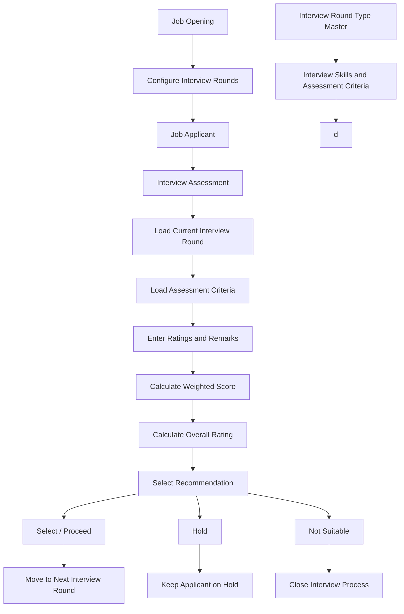

# Qauntbit Interview Assessment

## Introduction

Qauntbit Interview Assessment is a Frappe-based application designed to manage and streamline the interview assessment process.

The application helps HR teams and interviewers to:

- Configure interview round types
- Define assessment skills and criteria
- Configure rating scales
- Assign interview rounds to job openings
- Evaluate job applicants
- Enter skill-wise ratings
- Calculate weighted scores automatically
- Calculate overall interview ratings
- Manage applicant recommendations
- Move selected applicants to the next interview round
- Keep applicants on hold
- Mark applicants as not suitable
- Generate interview assessment reports

---

## Main Features

### 1. Interview Round Type

Create and manage different interview rounds.

Examples:

- HR Round
- Technical Round
- Managerial Round
- Final Round

---

### 2. Interview Assessment Criteria

Configure skills and assessment criteria for each interview round.

Example:

#### HR Round

- Communication
- Confidence
- Attitude
- Behaviour

#### Technical Round

- Technical Knowledge
- Programming Skills
- Problem Solving
- Subject Knowledge

---

### 3. Rating Scale

Configure rating scales used during the interview.

Example:

| Rating | Description |
|--------|-------------|
| 1 | Poor |
| 2 | Below Average |
| 3 | Average |
| 4 | Good |
| 5 | Excellent |

---

### 4. Job Opening Configuration

Configure interview rounds for a Job Opening.

Example:

| Sequence | Interview Round |
|----------|-----------------|
| 1 | HR Round |
| 2 | Technical Round |
| 3 | Managerial Round |
| 4 | Final Round |

---

### 5. Interview Assessment

The Interview Assessment form allows interviewers to evaluate job applicants.

Main information includes:

- Job Applicant
- Job Opening
- Interview Round
- Interviewer
- Assessment Date
- Assessment Criteria
- Rating
- Remarks
- Weighted Score
- Overall Rating
- Recommendation

---

### 6. Automatic Assessment Criteria Loading

When an interview round is selected, the application automatically loads the related assessment criteria.

This reduces manual work and ensures consistent applicant evaluations.

---

### 7. Weighted Score Calculation

The application automatically calculates the weighted score.

```text
Weighted Score = (Rating × Weightage) / 100
```

Example:

```text
Rating = 4
Weightage = 70%

Weighted Score = (4 × 70) / 100
Weighted Score = 2.8
```

---

### 8. Overall Rating

The application calculates the overall interview rating based on the ratings entered by the interviewer.

Example:

```text
Ratings = 4, 3, 5, 4

Total Rating = 16
Number of Criteria = 4

Overall Rating = 16 / 4
Overall Rating = 4
```

---

### 9. Recommendation

The interviewer can select one of the following recommendations:

- Select / Proceed
- Hold
- Not Suitable

#### Select / Proceed

The applicant moves to the next interview round.

#### Hold

The applicant remains on hold for further review.

#### Not Suitable

The interview process for the applicant can be stopped.

---

## Workflow Diagram



---

# Installation

## Prerequisites

Before installing the application, make sure the following are installed:

- Python
- Node.js
- Redis
- MariaDB
- Frappe Bench

You also need an existing Frappe Bench environment.

---

## Step 1: Go to Your Bench Directory

```bash
cd ~/frappe-bench
```

Replace `~/frappe-bench` with your actual Bench directory.

Example:

```bash
cd ~/bench-develop
```

---

## Step 2: Download the Application

Run:

```bash
bench get-app https://github.com/shravan-kolekar/qauntbit_interview_assisment.git
```

This command downloads the application into the `apps` directory.

---

## Step 3: Check Installed Apps

```bash
ls apps
```

You should see:

```text
qauntbit_interview_assisment
```

---

## Step 4: Install the Application on Your Site

First, check your site name:

```bash
ls sites
```

Example site:

```text
site1.local
```

Install the application:

```bash
bench --site site1.local install-app qauntbit_interview_assisment
```

Replace `site1.local` with your actual site name.

Example:

```bash
bench --site shravan.in install-app qauntbit_interview_assisment
```

---

# Starting the Application

## Development Mode

Go to the Bench directory:

```bash
cd ~/bench-develop
```

Start the Frappe development server:

```bash
bench start
```

After starting the server, open:

```text
http://127.0.0.1:8000
```

Login using your Frappe Administrator credentials.

---

## Check Application Installation

Run:

```bash
bench --site your-site-name list-apps
```

Example:

```bash
bench --site shravan.in list-apps
```

You should see:

```text
frappe
erpnext
hrms
qauntbit_interview_assisment
```

---

# Create a New Site

If you do not have a Frappe site, create one.

```bash
bench new-site site1.local
```

Then install the app:

```bash
bench --site site1.local install-app qauntbit_interview_assisment
```

Start the server:

```bash
bench start
```

Open:

```text
http://127.0.0.1:8000
```

---

# Complete Installation Commands

For a new user, the complete process is:

```bash
cd ~/frappe-bench

bench get-app https://github.com/shravan-kolekar/qauntbit_interview_assisment.git

bench new-site site1.local

bench --site site1.local install-app qauntbit_interview_assisment

bench start
```

Then open:

```text
http://127.0.0.1:8000
```

---

# Update Application

To update the application:

```bash
cd ~/frappe-bench/apps/qauntbit_interview_assisment

git pull origin develop
```

Then:

```bash
cd ~/frappe-bench

bench --site your-site-name migrate

bench restart
```

---

# Check Application Version

Run:

```bash
bench version
```

Or:

```bash
bench --site your-site-name list-apps
```

---

# Useful Commands

## Start Development Server

```bash
bench start
```

## Stop Development Server

Press:

```text
CTRL + C
```

## Restart Bench

```bash
bench restart
```

## Run Migration

```bash
bench --site your-site-name migrate
```

## Clear Cache

```bash
bench --site your-site-name clear-cache
```

## Clear Website Cache

```bash
bench --site your-site-name clear-website-cache
```

## Build Assets

```bash
bench build
```

## Check Application List

```bash
bench --site your-site-name list-apps
```

---

# Reports

The application provides interview assessment reporting functionality.

The report can be used to review:

- Job Applicant
- Job Opening
- Interview Round
- Interviewer
- Assessment Criteria
- Rating
- Weightage
- Weighted Score
- Overall Rating
- Recommendation

---

# Contributing

This application uses `pre-commit` for code formatting and linting.

Install pre-commit:

```bash
pip install pre-commit
```

Go to the application directory:

```bash
cd apps/qauntbit_interview_assisment
```

Install hooks:

```bash
pre-commit install
```

---

# License

MIT
